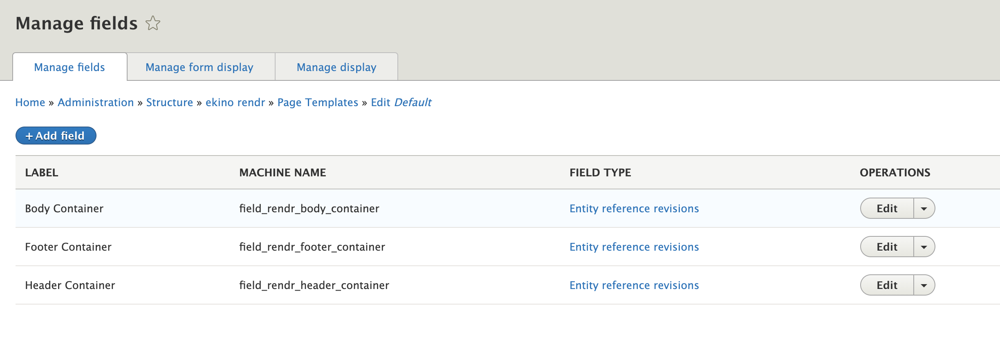
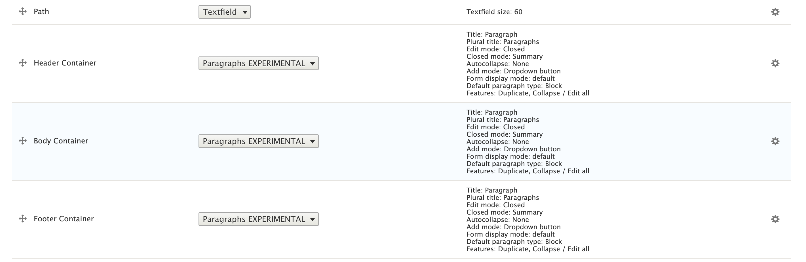
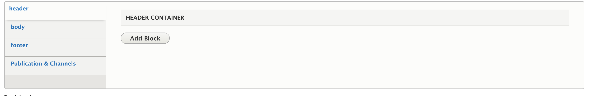
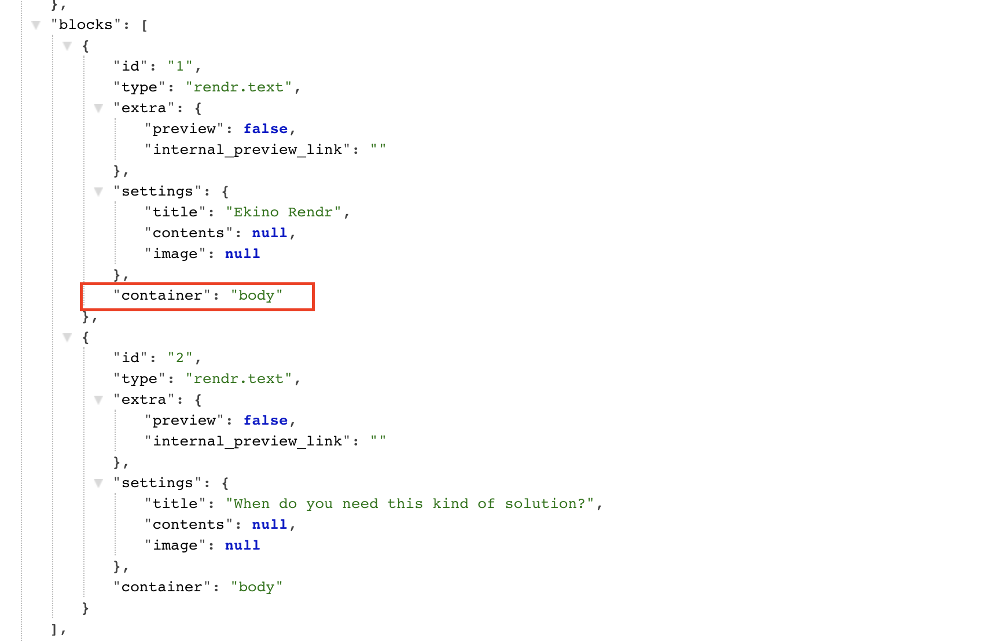

# Creating Page Templates

## Overview

Rendr Pages are based on Templates. Each template has an id, a label and a list of sections.
These sections, also called __Containers__ will determine how your page is going to be displayed.

## Managing sections
In order to add a new section to a template, create a new field to the template with a __machine name__
in the format `field_rendr_[my_container]_container`.
The type of field is an entity reference to __Paragraphs__

In the __manage form display__ tab, position the field in the order you would like the section to appear.
You can also control the paragraphs field display options.

This will automatically create a tab called `my container` in the page edition form for you to add blocks to the new section.

The api will also update the key __container__ for your blocks with the value `my_container`

